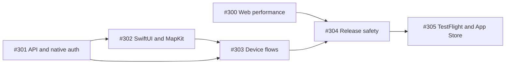

> **ARCHIVED — historical record only.** This document describes the
> pre-reconstruction application preserved at tag
> `archive/pre-reconstruction-2026-07-21`. It is not instructions and has no
> authority. Superseded by: native iOS program paused; see docs/decisions/source/01-reconstruction.md and the deferred register; branch state preserved in git. See `docs/RECONSTRUCTION.md`.

# Native iOS Launch Program Roadmap

**Objective:** Ship Work in Cafe 1.0 as a fast, fully native SwiftUI iPhone app while keeping the existing web product responsive, the consumer API stable, and the App Store release reversible at the server boundary.

**Approved design:** [`2026-07-15-native-ios-optimization-design.md`](../specs/2026-07-15-native-ios-optimization-design.md) in parent issue [#298](https://github.com/gibouu/workincafe/issues/298).

## Workstreams

| Order | Issue | Plan | Deliverable |
|---|---:|---|---|
| 1 | [#300](https://github.com/gibouu/workincafe/issues/300) | [`2026-07-15-web-performance-cleanup.md`](./2026-07-15-web-performance-cleanup.md) | Smaller initial bundle, bounded map/list rendering, accessible PWA shell |
| 2 | [#301](https://github.com/gibouu/workincafe/issues/301) | [`2026-07-15-consumer-api-native-auth.md`](./2026-07-15-consumer-api-native-auth.md) | Versioned OpenAPI consumer surface, bearer auth, universal links, account lifecycle |
| 3 | [#302](https://github.com/gibouu/workincafe/issues/302) | [`2026-07-15-native-ios-shell-map.md`](./2026-07-15-native-ios-shell-map.md) | SwiftUI shell, actor-isolated cache/API, clustered `MKMapView`, search/details/directions |
| 4 | [#303](https://github.com/gibouu/workincafe/issues/303) | [`2026-07-15-native-ios-device-flows.md`](./2026-07-15-native-ios-device-flows.md) | Native auth, favorites, location-gated contributions, Wi-Fi/noise/photo device flows |
| 5 | [#304](https://github.com/gibouu/workincafe/issues/304) | [`2026-07-15-release-safety.md`](./2026-07-15-release-safety.md) | Database replay, moderation, legal/privacy, observability, CI, security and device gates |
| 6 | [#305](https://github.com/gibouu/workincafe/issues/305) | [`2026-07-15-testflight-app-store.md`](./2026-07-15-testflight-app-store.md) | Signed archive, TestFlight progression, App Review, phased release and monitoring |

## Dependency path

Issue #300 and the contract/database portions of #301 can begin together. The native shell starts when #301 freezes the read contract and generated Swift package. Device flows start after the shell and mutation contracts compile together. External TestFlight cannot begin before #304 signs the safety gate; App Review cannot begin before external beta exit criteria pass.

## Execution waves

1. **Foundation:** implement #300 and the database/OpenAPI/auth portions of #301 with test-first commits; freeze `/api/v1` and generated clients.
2. **Native discovery:** implement #302, verify cached launch and map budgets in Simulator and on physical iPhones, and close all visual-companion notes.
3. **Native participation:** implement #303 against the frozen API; verify interruption, permission, cancellation, offline, and privacy behavior on devices.
4. **Release hardening:** implement #304, including moderation and deletion guarantees, production-like migration replay, monitoring drills, archive privacy scans, and GitHub `macos-26` CI.
5. **Distribution:** implement #305 through internal TestFlight, external TestFlight, App Review, manual/phased release, and post-launch monitoring.

## Program gates

- **Contract gate:** OpenAPI lint/diff/code generation is reproducible; cookie and bearer behavior match; RLS forgery tests fail closed.
- **Experience gate:** cached map is usable within 1.5 seconds cold and 750 ms warm; cached annotation feedback is within 100 ms; dense-map CPU/memory traces meet the budgets in #302.
- **Privacy gate:** tokens remain in Keychain; exact contribution coordinates and raw audio are never persisted; photos remain disabled until moderation/report/block/delete cleanup is proven.
- **Quality gate:** web, Swift package, iOS unit/UI, contract, migration, security, accessibility, and physical-device matrices pass with no P0/P1 defects.
- **Beta gate:** internal TestFlight smoke and telemetry pass before external testers; external exit criteria and reviewer materials pass before submission.
- **Launch gate:** production support, alerts, feature flags, phased-release controls, and tested hotfix procedure have named owners before release.

## Definition of live

App Store Connect shows Work in Cafe 1.0 available to customers. A clean App Store install can launch, browse/search the native map, view details, authenticate, favorite, submit a freshly geo-verified contribution, export data, and request account deletion. Production monitoring is healthy, support and privacy URLs resolve, and risky server-backed functionality can be disabled without breaking read-only discovery.
